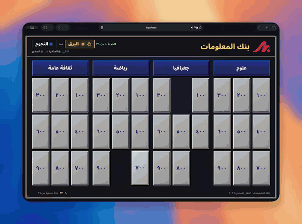

# Kanz (كنز)

A live quiz game show inspired by the classic TV show *بنك المعلومات*. The audience watches the main screen, the host runs the game from the admin screen on another device, and a co-host can follow along on the optional MC screen.

<p align="center">
  
</p>

- **Main screen** (`/`): board, questions, answer reveals, award banners and a
  leaderboard reveal with spotlights for the top three. View-only.
- **Admin** (`/admin`): open tiles, judge answers, award points, switch the
  screen, play the soundboard and fix mistakes afterwards.
- **MC room** (`/mc`): a read-only view with every answer, for a co-host.
- **Setup** (`/setup`): a first-run onboarding wizard, then a full editor for
  questions, teams, points, the round schedule, media and sounds. Questions can
  be imported from Excel or CSV.
- **كنز** (treasure, multiplied points) and **كشكول** (challenge) tiles, any
  number per category, each opening with a picture or a video.
- An optional, fair **round schedule** pairing two teams per tile.

## Quick start

```sh
git clone https://github.com/habema/kanz.git && cd kanz
cp .env.example .env
# put a long random string in SESSION_SECRET, e.g. `openssl rand -hex 32`
docker compose up --build -d
```

Open <http://localhost:8000> and follow the setup: create the admin password,
then name the quiz and add teams and questions. Then share or cast `/` to the
audience and open `/admin` on another device, using the computer's network
address ([details](https://habema.github.io/kanz/guide/getting-started#opening-the-screens)).

## Documentation

The full guide (onboarding, running a game, rules, schedule, question import,
media and sounds, security, development) is published at https://habema.github.io/kanz/.

## Development

```sh
pnpm install && pnpm run typecheck && pnpm run test
```

See https://habema.github.io/kanz/guide/development.

## License

[MIT](LICENSE).
